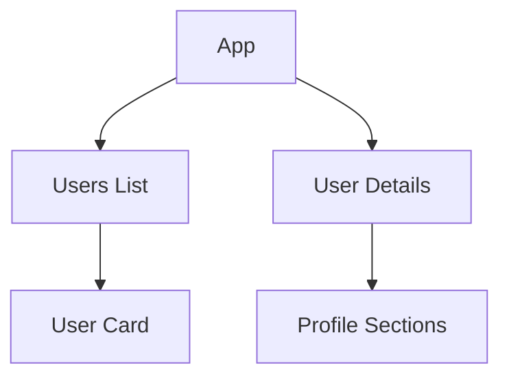

# 🚀 User Management Mini-App

A sleek, responsive React application for browsing and viewing user details from the [JSONPlaceholder](https://jsonplaceholder.typicode.com/) API.

---

## ✨ Features

### 📋 User List View

✅ **Responsive grid layout** – Adapts to any screen size
✅ **Interactive cards** – Subtle hover effects for better UX
✅ **Essential info** – Name, username, and email at a glance

### 👤 User Detail View

✅ **Complete profile** – All user data in an organized layout
✅ **Sectioned content** – Personal info, address, and company details
✅ **Consistent styling** – Matches the list view for seamless navigation

---

## ⚙️ Technical Implementation

### 🛠 Core Stack

| Technology       | Purpose                         |
| ---------------- | ------------------------------- |
| **React 18**     | Component-based UI              |
| **React Router** | Smooth navigation between views |
| **Axios**        | Clean API requests              |
| **CSS Modules**  | Scoped, maintainable styling    |

### 🧩 Key Components

